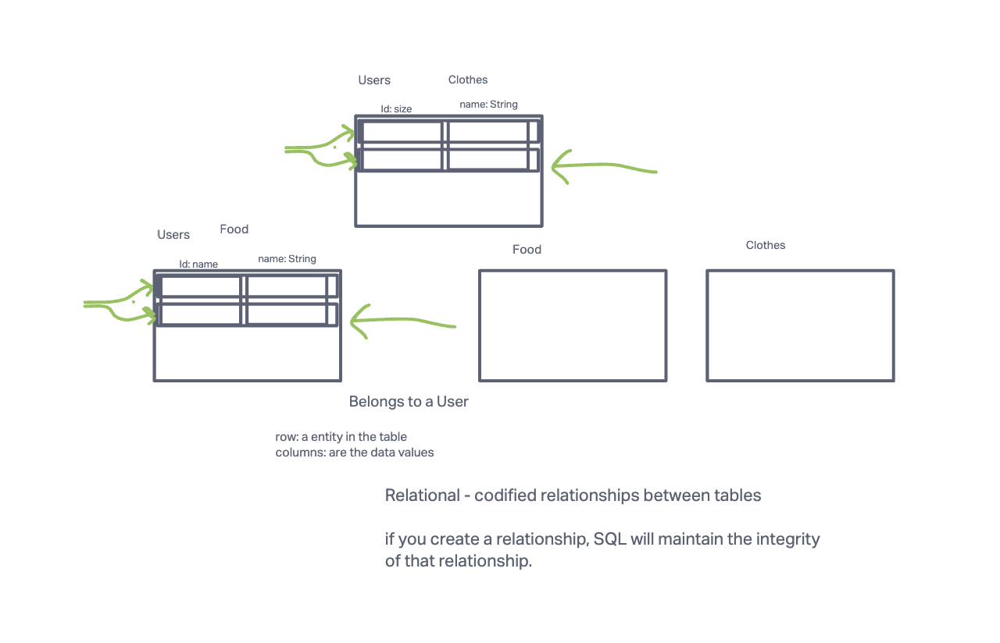

# Api-server

In this assignment, I will be building a REST API using Express and Sequelize for two data models. I will implement CRUD operations, write integration tests, and set up proper error handling. Additionally, I will deploy my server to a cloud service provider and include the deployed URL in my README for grading.

[Render Deployement](https://adnan-api-server.onrender.com)

## Documentation

Document the code review process as a lab-04 feature on your README.

Who was your partner?

Tiffani Rice

What was your key takeaway?

I had the oppurtunity to go over Tiffani's code and add in some comments to her code for improvements and giving her credits on parts where she did great. I was also able to get some undersatnding on my code when reviewing her code which was cool.

Share the link to your PR request.

[My PR](https://github.com/Tiffanirice23/api-server/pull/4)

Share the link to their PR request.

[Her PR](https://github.com/adnanm123/api-server/pull/4)
